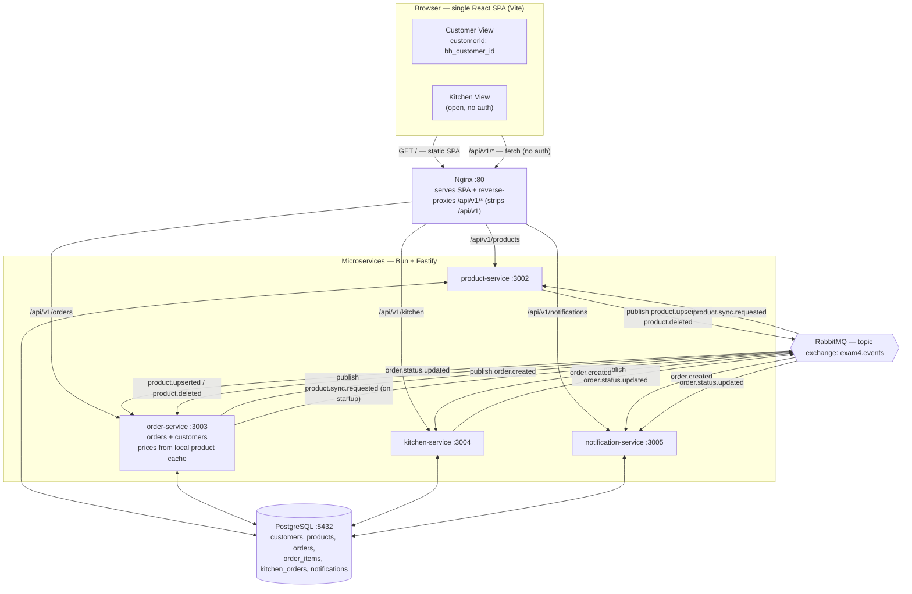
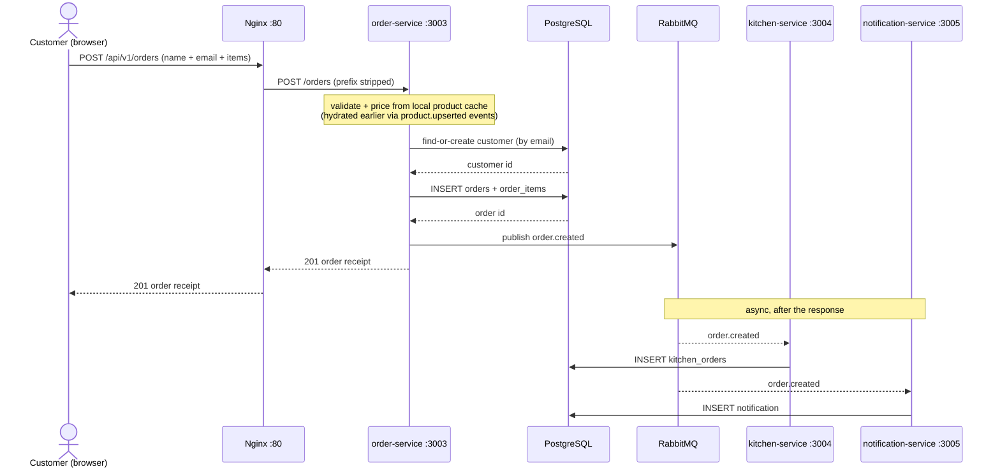

# Architecture

A food-ordering system built as an **API gateway + microservices** design with an
**event-driven** core. One React SPA (Customer + Kitchen views) talks to Nginx, which
serves the SPA and reverse-proxies API calls to four Bun + Fastify services backed by a
shared PostgreSQL database. Services stay loosely coupled by publishing/consuming events
over RabbitMQ.

## Tech stack

| Layer | Technology |
|-------|-----------|
| Frontend | React + Vite (single SPA, two views) |
| Gateway | Nginx (serves SPA, reverse-proxies `/api/*`) |
| Services | Bun runtime + Fastify (TypeScript) |
| Auth | None — guest checkout (customer identified by name + email) |
| Database | PostgreSQL (single shared `exam4` db) |
| Messaging | RabbitMQ — topic exchange `exam4.events` |

## Diagram 1 — Component / system overview

## Diagram 2 — Request flow: placing an order ("to the DB and back")

## Legend & talking points

- **Solid HTTP arrows are synchronous** request/response (browser → Nginx → service →
  PostgreSQL → back). The customer gets their order receipt *before* the async work runs.
- **RabbitMQ arrows are asynchronous events.** Services never call each other to fan out
  work — they publish to the `exam4.events` topic exchange and interested services react.
  This keeps them loosely coupled: kitchen and notification can fail/restart independently
  without breaking order creation.
- **Two event types** drive the customer flow:
  - `order.created` — published by **order-service**; consumed by **kitchen-service**
    (creates the kitchen ticket) and **notification-service** (notifies the customer).
  - `order.status.updated` — published by **kitchen-service** when staff advance an order
    (pending → preparing → ready → completed); consumed by **order-service** (syncs the
    `orders.status`) and **notification-service** (notifies the customer).
- **No synchronous service-to-service calls.** order-service prices orders from a local
  in-memory product cache instead of calling product-service over HTTP, so placing an order
  has no runtime dependency on another service. The cache is kept in sync by three more
  events: product-service publishes `product.upserted` / `product.deleted`, and order-service
  publishes `product.sync.requested` on startup to ask for a full rebroadcast. The client's
  prices are still never trusted — pricing is resolved server-side from the cache.
- **Single shared PostgreSQL.** Every service reads *and* writes (bidirectional arrows).
  This is a deliberate simplification for the exam; a stricter microservice design would
  give each service its own database.
- **One SPA, two views.** Customer and Kitchen are views in the same React app. There is no
  login: the customer places an order with their name + email, and the backend find-or-creates
  the customer (by email) and returns a `customerId` that the SPA stores in localStorage
  (`bh_customer_id`) to fetch that customer's orders and notifications. The Kitchen view is open.
- **Nginx is the single entry point** on port 80: it serves the built SPA *and* strips the
  `/api/v1` prefix when proxying (e.g. `/api/v1/orders` → `order-service:/orders`).
